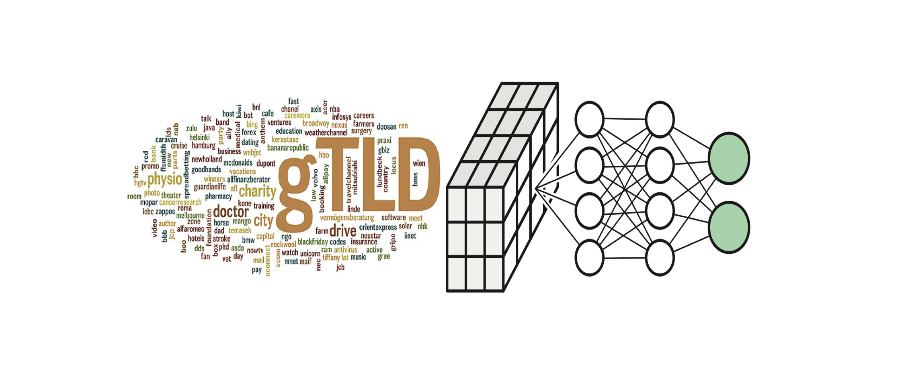

# PatternEx domain feed                  

    




We provide a list of malicious domains identified with one of our deep learning (AI) models developed at [PatternEx](https://www.patternex.com). The list is updated on a **daily** basis and reports malicious domains weeks before they are flagged on any other blacklist. The feed is released as a set of csv files (detections*.csv), each with a maximum of 100K domains, where each line contains:
- the detection date (yyyy-mm-dd)
- the reported domain (for instance windowdowngradegreataflash[.]icu) 
- the category (currently we are reporting social engineering domains)
- the score (probability of the domain being malicious)

Below we show a sample of domains detected on 2018-11-14:

```
detection_date,domain,category,score
2018-11-14,topgreatdowngradeaflash[.]icu,social engineering,1.0
2018-11-14,upgradedowngradegreataflash[.]icu,social engineering,1.0
2018-11-14,upgradegreatdowngradeaflash[.]icu,social engineering,1.0
2018-11-14,windowdealdowngradeaflash[.]icu,social engineering,1.0
2018-11-14,windowdowngradegreataflash[.]icu,social engineering,0.9993
```

## How to use the feed? 
The feed is available for non-commercial use and without warranty; it may be used for any activity ranging from AI/ML, threat hunting, or live detection. We encourage users to check whether the correlation of the PatternEx feed with the network traffic logs of their organization results in malicious findings missed by existing organizational security defenses. We would love to hear your success (or failure) stories! 

## Initial stats of the feed: 
We started publishing this feed in November 2018 (2018-11-14), it initially contained 197.6K malicious domains. These domains are retrieved from the zone files of multiple top level domains (.bid, .date, .download, .fun, .host, .icu, .loan, .online, .pro, .review, .site, .space, .stream, .tech, .top, .trade, .website, .win, and .xyz) available via the Centralized Zone Data Service (https://czds.icann.org/en). 

## Call to action: 
We look forward to expanding the feed by either analyzing other open data sources, or by detecting other categories of malicious domains. Either way, if you would like to contribute to this project please do get in touch!  

## How to cite
[Acquire, adapt, and anticipate: continuous learning to block malicious domains](https://ieeexplore.ieee.org/document/8622197), I. Arnaldo, A. Arun, S. Kyathanahalli, and K. Veeramachaneni, 2018 IEEE International Conference on Big Data (Big Data), 2018

```
@INPROCEEDINGS{2018_arnaldo, 
    author={I. {Arnaldo} and A. {Arun} and S. {Kyathanahalli} and K. {Veeramachaneni}}, 
    booktitle={2018 IEEE International Conference on Big Data (Big Data)}, 
    title={Acquire, adapt, and anticipate: continuous learning to block malicious domains}, 
    year={2018},  
    pages={1891-1898}, 
    doi={10.1109/BigData.2018.8622197}, 
    month={Dec}
}
```

## Copyright
Copyright (c) 2018 PatternEx Inc. The data is distributed under the Creative Commons Attribution-NonCommercial-ShareAlike 4.0 International (CC BY-NC-SA) license. [](https://creativecommons.org/licenses/by-nc-sa/4.0/). You may use the data for limited, non-commercial purposes and with no expectation of warranty nor support. 

For further information please contact: iarnaldo at patternex dot com
